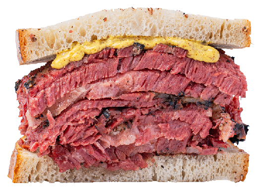
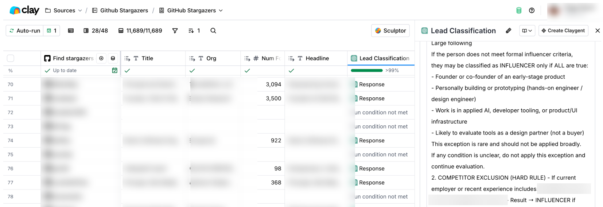

<!--
notes: Who here has created an agent skill? Keep your hand raised if you use them weekly. Daily. 10 times a day? 100 times a day? How about 10,000 times a day? Today I'm here to share some tips on how I've built reliable skills that my agent uses in production at least 10,000 times a day! I've given versions of this as a skills training to my clients and both engineers and non-technical people have learned something new. So I hope you do too!
-->

# Skills That Survive Production

Good output = judgment + contract

---

<!--
layout: intro-photo
notes: My name is Peggy. I am an engineer turned marketer, and I have worked with founders at companies like Render, Imbue, LiveKit, and InsForge on launches and early GTM. Before scale.dev, I was at Apollo GraphQL for 7 years. A lot of this talk comes from manually building the same workflows over and over again, first as services, and now in my marketing agent Kite.
-->

# @peggyrayzis

- scale.dev: Engineer turned marketer shipping launches for devtools/AI founders
- Live in Jersey City with my dog Simba
- Building Kite, a marketing agent that runs on skills


---

<!--
notes: When skills came out, I was hooked. For me, it kind of felt like the first time I built an app with React. Finally I had a structure and a language for composing my marketing workflows and sharing them with clients without copying and pasting prompts around.

I went down the rabbit hole with Pi, which is a minimal agent harness you can customize with skills. I packaged all of my positioning, lead scoring, and launch workflows into skills, then I turned them into a background agent with Pi. Now it's in production with a few of my seed stage clients! All of this truly opened my mind to what's possible with skills, and even though the AI world moves fast, I think they're an important foundation for how we'll make agents actually useful.
-->

# Skills gave me a shape for repeatable judgment

Finally, a way to package how I work.

---

<!--
tone: blue
eyebrow: Skills 101
notes: First I want to give a quick refresher on what agent skills are. They're a set of reusable instructions that encode your taste and judgment for the model. So often I see people cargo culting other people's skills and I think they're missing the point. Good skills are customized to you and your business.

Skills are progressively disclosed which means they're only loaded into context when you invoke them with a slash command or the model decides to invoke them after matching your intent to the description field in the skill.
-->

# Skills

- Reusable instructions
- Progressive disclosure
- Taste and judgment for the model

---

<!--
eyebrow: Skills 101
layout: continuum
notes: Most skills you see people sharing today are user-invoked. They might use them only a few times a week, so maybe it's not as important that they're tested and reliable. A few harness-specific skills you may have tried are
-->

# User vs. model-invoked skills

- **User-invoked** `/plan`
- **Mostly user-invoked** `/goal`
- **Mostly model-invoked** `/compact`
- **Fully model-invoked** `today's talk`

---

<!--
tone: green
layout: split-list
notes: I do not want to overclaim the component analogy, but it helps people understand the direction. Skills are becoming reusable pieces of agent behavior that teams can own, version, compose, and improve.
-->

# Skills <> Components

- Reusable
- Composable
- Shared across teams
- Portable across agents

---

<!--
eyebrow: Pattern
layout: contract-sandwich
notes: This is the portable shape. The domain can be lead qualification, incident response, customer escalation, or code review. The shared thing is a queue where the agent needs to make a judgment and return something structured.
-->

# The skill sandwich

- **Inputs** Evidence the agent can cite
- **Judgment** The call it makes
- **Output** Contract another system can trust



---

<!--
eyebrow: Pattern
layout: contract
notes: Lead qualification is my concrete example because this is the workflow I have actually run at scale. I should be explicit that the pattern is not lead-specific.
-->

# Lead qualification

- **Inputs** Social, product, company signals
- **Judgment** Fit, exclusion, confidence
- **Output** Evidence + next step

---

<!--
eyebrow: Pattern
layout: contract
notes: You can abstract this pattern to many other types of skills that require judgment to product a priority queue, like incident triage.
-->

# Incident triage

- **Inputs** Alert, logs, runbook, ownership
- **Judgment** Severity, blast radius, owner
- **Output** Route + next step

---

<!--
eyebrow: Pattern
layout: contract
notes: Customer escalation is another one. Tickets and account context in -> Policy and judgment on urgency -> Route it to the next layer in your system
-->

# Customer escalation

- **Inputs** Ticket, account, history
- **Judgment** Urgency, risk, missing info
- **Output** Route + next step

---

<!--
tone: blue
eyebrow: What not to do
layout: clay-artifact
notes: Most of the skills you see are actually big giant prompts. Before my marketing agent was a thing, I built lead scoring for my clients in Clay. There would be weird edge cases and questions from clients about why this lead that I couldn't always answer because the prompt had a lot of branching logic in prose that was impossible to test.
-->

# Skillslop

2,000+ line SKILL.md is just a giant prompt



---

<!--
tone: green
eyebrow: Best Practices
notes: First you want to break your skills into sub-workflows. For lead scoring, maybe you have one for handling exclusions. Or maybe in the case of a bug report, you have different policies for handling bugs from contributors vs. users. Whatever it is, you'll want to keep your SKILL.md short and link out to reference documentation or example schemas in references/.
-->

# 1. De-slop your skills

- `SKILL.md`: trigger + routing
- `references/`: specs and examples
- `scripts/`: deterministic checks
- `evals/`: cases that should not regress

---

<!--
eyebrow: Best Practices
layout: code
notes: This skill runs on 100,000 records a week, so the output must be consistent. I like grading high, med, low over a numerical score. Codex will give you skills closer to this style than Claude.
-->

# 2. Use output schemas

```json
"outputs": {
  "account_fit": ["high", "medium", "low"],
  "person_fit": ["high", "medium", "low"],
  "tier": [0, 1, 2, 3],
  "confidence": ["high", "medium", "low"]
},
"required_output_fields": [
  "account_fit",
  "person_fit",
  "tier",
  "confidence",
  "reasons",
  "exclusions_matched"
],
```

---

<!--
eyebrow: Best Practices
layout: code
notes: Each skill's description is loaded into context and the model uses that to decide when to invoke it. I like to use "JTBD" verbs and talk about when to run the skill, like before sending Slack alerts or exporting to a CRM. There's also a Slack bot component of my agent, I had to do a bit of work testing different descriptions and mapping those to user intent in order to get them to trigger reliably.
-->

# 3. Use verbs in trigger descriptions

```md
Bad:
description: ICP fit skill for people and accounts

Better:
description: Score enriched leads, check fit and exclusions,
and prioritize before outbound, Slack alerts, or CRM export.
```

---

<!--
tone: blue
eyebrow: Testing skills
notes: Start small, you can get pretty far with 5 evals to start.
-->

# Evals make skills real

- Trigger: did the model invoke the skill?
- Shape: can code parse the output?
- Judgment: does it match hand review?
- Cost: did we load too much context?

---

<!--
tone: blue
eyebrow: Testing skills
notes: Quality validators are the bridge from abstract evals to the demo. Keep them specific, boring, and testable. Did the skill respect my exclusion? If there is a next action like adding to an outbound campaign, was it blocked for tier 0 leads? Were leads with missing evidence handled as low confidence?
-->

# Start with 3-5 boring quality validators

- Evidence required
- Low confidence handled
- Exclusions respected
- Unsafe actions blocked

---

<!--
eyebrow: Testing skills
notes: I ran a little experiment using our attendee list for this meetup and an adapted version of my lead scoring skill for Kite. First, a big skill with 1000+ lines, then a slim "sandwich" skill with a ICP spec, a schema, and checks.
-->

# Triaging meetup attendees

- Big skill: one giant SKILL.md
- Thin skill: context pointers, schema, checks

---

<!--
tone: green
eyebrow: Benchmark
layout: benchmark
notes: This is the first half of the production question: not whether the model can produce a plausible answer once, but how the distribution changes when the skill has less prose and a clearer contract. Generally I want fewer leads scored
-->

# What survives production?

```text
Skill          Tokens  Rows  Tier 1    Tier 2    Tier 3   Tier 0
thin skills    2,603   114   35 (31%)  14 (12%)  2 (2%)   63 (55%)
thick skills   7,001   114   38 (33%)  16 (14%)  6 (5%)   54 (47%)
```

---

<!--
tone: green
eyebrow: Benchmark
layout: benchmark
notes: This is the second half: the production-shaped skill has to preserve evidence, uncertainty, exclusions, and the output contract. A thick skill can look helpful while violating the boundaries another system depends on.
-->

# What survives production?

```text
Skill          Evidence required  Low confidence handled  Exclusions respected  Output contract pure  Problems
thin skills    pass               pass                    pass                  pass                  0
thick skills   pass               fail                    fail                  fail                  110
```

---

<!--
tone: green
eyebrow: Takeaway
notes: I want to go back to my formula from the beginning. To get to this higher level of AI enlightment with "loop engineering" and removing yourself from invoking skills manually and checking your agents, I think it's going to be important to master building agent-invoked skills. The smallest thing you can do today is take one of your skills, add some structured outputs and a few test cases, then iterate and improve.
-->

# Skills That Survive Production

Good output = judgment + contract

---

<!--
layout: thanks
notes: Thank you so much, if you scan the QR code you have access to the example ICP skill that you can adapt for your business. Make sure you customize it by adding in examples of your customers and what tier 1/tier 2/tier 3 means in the context of your GTM.
-->

# Thank you!!

Scan the QR code for my slides + skills. DM me with questions anytime!


